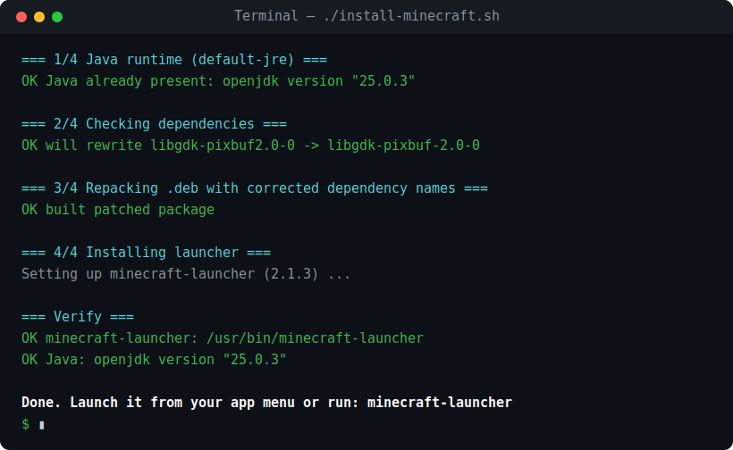

# minecraft-deb-ubuntu-fix

Install the official **Minecraft Launcher `.deb`** on modern **Ubuntu (24.04+, incl. 26.04)** when it fails with a dependency error like:

```
minecraft-launcher : Depends: libgdk-pixbuf2.0-0 (>= 2.22.0) but it is not installable
```

or when the installer complains about a missing **Java** runtime.

This isn't a Minecraft bug — it's package metadata that hasn't kept up with Ubuntu's library renames. The launcher itself runs fine once the `.deb` installs.



<sub>☝️ What a successful run looks like — a few green <code>OK</code> lines and a <code>Done.</code> at the end.</sub>

---

## Easy step-by-step guide (never used Linux before? start here)

No experience needed. Just follow these steps in order. You'll copy some text, paste it, and press Enter. That's it.

### Step 1 — Download Minecraft

1. Open your web browser and go to **<https://www.minecraft.net/download>**.
2. Find the button for **Debian / Ubuntu** and click it to download.
3. The file (called **`Minecraft.deb`**) will save into your **Downloads** folder. You don't need to open it — just remember it's there.

### Step 2 — Open the Terminal

The Terminal is a window where you type commands. To open it:

- Press the **`Ctrl`** + **`Alt`** + **`T`** keys at the same time.

A black or dark window will appear with a blinking cursor. This is where you'll paste the commands below.

> 💡 **Tip:** In the Terminal, **Ctrl+C / Ctrl+V don't paste** like normal. To paste, use **`Ctrl` + `Shift` + `V`**, or just **right-click** and choose *Paste*.

### Step 3 — Download the helper and run it

Copy the whole block below, paste it into the Terminal, and press **Enter**:

```bash
cd ~/Downloads
wget https://raw.githubusercontent.com/brantgoe/minecraft-deb-ubuntu-fix/v1.0.1/install-minecraft.sh
chmod +x install-minecraft.sh
./install-minecraft.sh
```

Here's what each line does, in plain English:

| Line | What it means |
|------|---------------|
| `cd ~/Downloads` | Go to your Downloads folder (where Minecraft was saved). |
| `wget …install-minecraft.sh` | Download this helper script from the internet. |
| `chmod +x install-minecraft.sh` | Give the script permission to run (make it "executable"). |
| `./install-minecraft.sh` | Run it. It does the rest for you. |

### Step 4 — Type your password when asked

The script needs permission to install software, so it will ask for **your password** (the one you use to log in to the computer).

> ⚠️ **Important:** When you type your password in the Terminal, **nothing appears on screen** — no dots, no stars, nothing. That's normal and on purpose. Just type it and press **Enter**.

Then wait a minute while it works. When it's done you'll see a green **`Done.`** message.

### Step 5 — Play!

Click your apps menu (the grid of icons, usually bottom-left or by pressing the **Super/Windows key**), type **`Minecraft`**, and click the icon.

The first time, Minecraft will ask you to sign in with your **Microsoft account** — that's the normal Minecraft login, not part of this fix.

**That's it. Have fun!** 🎮

If something goes wrong, see [Troubleshooting](#troubleshooting) near the bottom.

---

## Quick version (comfortable with a terminal)

```bash
# 1. Download the Debian/Ubuntu launcher from https://www.minecraft.net/download
#    (usually lands in ~/Downloads/Minecraft.deb)

# 2. Grab and run the script
cd ~/Downloads
wget https://raw.githubusercontent.com/brantgoe/minecraft-deb-ubuntu-fix/v1.0.1/install-minecraft.sh
chmod +x install-minecraft.sh
./install-minecraft.sh              # uses ~/Downloads/Minecraft.deb
# or point it at the file:
./install-minecraft.sh /path/to/Minecraft.deb
```

Then launch from your app menu, or run `minecraft-launcher`.

## What it does

1. **Installs Java first.** The `.deb` depends on `default-jre`, but a fresh system has none, so the install aborts before it starts. The script installs `default-jre` up front. *(If you already have any JRE/JDK, it's left alone.)*
2. **Repairs stale dependency names.** It simulates the install (`apt-get install -s`), reads back exactly which dependencies apt calls *"not installable"*, finds the current package that satisfies each, rewrites them in a repacked copy of the `.deb`, and installs that. Your original download is never modified.
3. **Verifies** that `minecraft-launcher` landed on your `PATH`.

If a stale dependency can't be matched to any current package, the script **stops and tells you** rather than installing something broken.

## Why the vendor `.deb` breaks on new Ubuntu

Two rounds of renaming:

- **The 64-bit `time_t` transition (Ubuntu 24.04+)** renamed many libraries with a `t64` suffix — `libcurl4` → `libcurl4t64`, `libasound2` → `libasound2t64`, `libgcc1` → `libgcc-s1`, and so on. These carry a compatibility `Provides:`, so apt matches the old names automatically. **Not** the problem.
- **`libgdk-pixbuf2.0-0` → `libgdk-pixbuf-2.0-0`** (note the extra dash) has **no** such `Provides:`. The library is installed and newer than required, but apt can't match the old name — so the whole install fails. **This** is the blocker.

The script's rename detection handles both shapes (and appends/inserts the common patterns for forward-compatibility with future renames).

## Requirements

- Ubuntu / Debian with `apt-get` and `dpkg-deb` (standard).
- `sudo` access (for installing packages).
- The official Minecraft launcher `.deb` from <https://www.minecraft.net/download>.

## Manual fix (if you prefer to do it by hand)

```bash
# Java
sudo apt-get update && sudo apt-get install -y default-jre

# Repack the .deb with the corrected dependency name
mkdir /tmp/mc && dpkg-deb -R ~/Downloads/Minecraft.deb /tmp/mc
sed -i 's/libgdk-pixbuf2\.0-0/libgdk-pixbuf-2.0-0/g' /tmp/mc/DEBIAN/control
dpkg-deb -b /tmp/mc ~/Downloads/Minecraft-fixed.deb

# Install (apt resolves the rest via Provides)
sudo apt-get install -y ~/Downloads/Minecraft-fixed.deb
```

## Troubleshooting

**"`wget: command not found`"**
Your system doesn't have `wget`. Install it first, then retry Step 3:
```bash
sudo apt-get install -y wget
```
(Or swap `wget <url>` for `curl -LO <url>` — most systems have one or the other.)

**"Minecraft .deb not found"**
The script looks in your Downloads folder for a file named exactly `Minecraft.deb`. Make sure Step 1 finished and the file is really in **Downloads**. If it downloaded with a different name (e.g. `Minecraft(1).deb`), tell the script where it is:
```bash
./install-minecraft.sh ~/Downloads/"Minecraft(1).deb"
```

**"Permission denied" when running `./install-minecraft.sh`**
You skipped the `chmod +x` line. Run it, then try again:
```bash
chmod +x install-minecraft.sh
./install-minecraft.sh
```

**It asks for a password but won't accept it**
Remember: typing shows nothing on screen (no dots). Type carefully and press Enter. Use the same password you log in to the computer with.

**It stops after "`=== Confirming dependencies resolve ===`" and nothing happens**
This was a bug in v1.0.0 of the script: on systems where the repair *succeeded*, it
silently quit at this step instead of continuing to the install. Nothing was changed
on your system. Close that terminal window, re-download the script (Step 3 — it now
fetches the fixed v1.0.1), and run it again.

**Anything else**
Copy the red `ERR` message and open an issue (see below) — include your Ubuntu version, which you can get with:
```bash
cat /etc/os-release
```

## Contributing

Hit a *different* "not installable" dependency? Open an issue with your Ubuntu
version (`cat /etc/os-release`) and the script output — or send a PR adding the
mapping to `KNOWN_RENAMES` in `install-minecraft.sh`.

## License

MIT — see [LICENSE](LICENSE). Not affiliated with or endorsed by Mojang or Microsoft. "Minecraft" is a trademark of Mojang Synergies AB.
